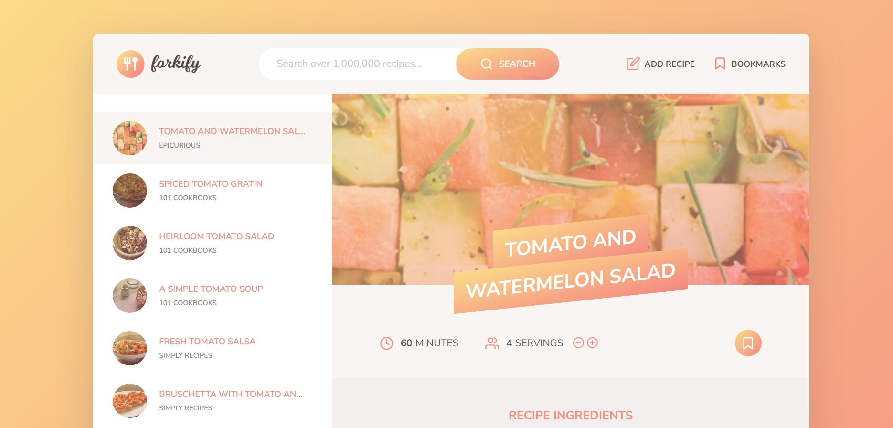

    <!-- <a href="https://todo-react-app-iota-seven.vercel.app/"> -->
     
    </a>
  <h3>
    <strong>Forkify Recipe App</strong>
  </h3>
  <!-- <a href="https://todo-react-app-iota-seven.vercel.app/">
        ✨ Website ✨
    </a> -->

## 🛠️ Stack

**Description:**
Forkify is a recipe app that allows users to search and discover new recipes. The app uses the Forkify API to fetch recipe data and provides a user-friendly interface to browse and view recipes.

**Features:**

* Search for recipes by keyword or ingredient
* Browse through a list of popular recipes
* View detailed recipe information, including ingredients and cooking instructions
* Error handling for API requests and recipe data

**Technologies Used:**

* TypeScript for front-end development
* Parcel for bundling and serving the application
* Forkify API for recipe data

**Getting Started:**
1. Install pnpm using npm install -g pnpm or yarn global add pnpm
2. Clone the repository using `git clone https://github.com/your-username/your-repo-name.git`
3. Install dependencies using `pnpm install`
4. Start the development server using `pnpm dev`
5. Open the app in your browser at `http://localhost:1234`

